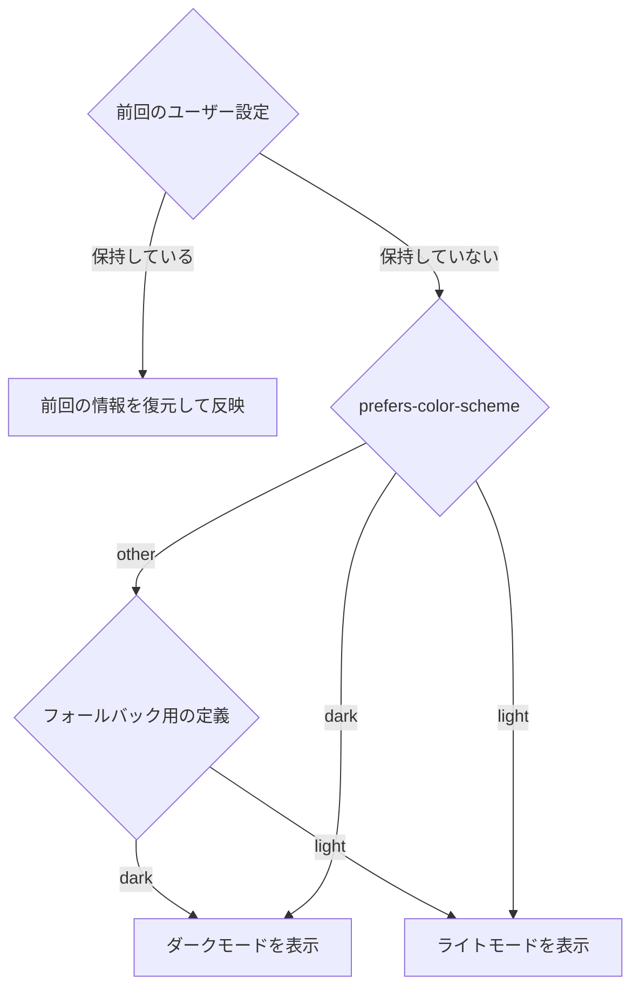

# ダークモード対応について

私はダークモード大好きなんですが世の中のダークモード対応の需要って実際どの程度あるのかよく分かっていません。  
ただ、需要には関係なくやり方は知っておきたいので備忘録も兼ねて調べた内容をまとめておこうと思います。

## 前提知識

この記事は下記の知識がある前提で進めます。

- ダークモードがそもそも何なのか理解している
- 基礎的なHTML/CSSに関する知識
  - CSS変数とか

## ダークモード対応の手法

ダークモードの対応と言っても正式化された仕組みがあるわけではないのでサイトによって対応はまちまち  
一応やり方としてはある程度の共通認識はありそうだが、この記事では私が個人的に良いと思ったやり方を中心に取り上げていきます。

ダークモードの対応として多いのがCSS変数を利用して色を定義し、`body`や`html`タグのクラス名を変化させて色の定義を切り替える方法だと思う。  
イメージとしては下記のようなコードになると思う。

```css:color.css
/* デフォルトの配色を定義 */
:root {
  --c-primary: #c75000;
  --c-white: #fff;
  --c-light: #eee;
  --c-lighter: #ccc;
  --c-black: #000;
  --c-dark: #111;
  --c-darker: #333;
}

/* ダークモード時に配色が入れ替わるように設定 */
html.dark {
  --c-primary: #c75000;
  --c-white: #000;
  --c-light: #111;
  --c-lighter: #333;
  --c-black: #fff;
  --c-dark: #eee;
  --c-darker: #ccc;
}

/* 定義した色を使用してスタイルを組んでいく */
body {
  background-color: var(--c-lighter);
  color: var(--c-darker);
}
```

あくまで一例だがJSの実装はこんな感じで

```js:darkMode.js
let darkMode = false;

/** ダークモード変更用の関数を定義 */
const toggleDarkMode = () => {
  darkMode = !darkMode;
  const theme = darkMode ? 'dark' : 'light';

  // classの変更
  document.documentElement.classList.remove('dark', 'light');
  document.documentElement.classList.add(theme);
};

// トグル用の要素などがあればイベントを定義
const toggleElement = document.querySelector('.toggle-button');
toggleElement.addEventListener('click', toggleDarkMode()};
```

しかし、この対応だけではいくつか満たせていない要件があるので次項からはその要件を満たすための工夫を紹介します。

## ブラウザのデフォルトUIパーツが浮いてしまう問題

https://hail2u.net/blog/meta-name-color-scheme.html

この記事にもあるように単純にCSS側でダークモードを切り替える場合、ブラウザにテーマ情報が伝わらずデフォルトのUIパーツが明るいままになってしまう。

### meta\[name="color-scheme"]と組み合わせる

そのため通常のCSSでの制御とあわせてmetaの定義と変更を行う。  
まずは下記のmetaを追加して

```html:index.html
<meta name="color-scheme" content="light dark">
```

::: message
`meta[name="color-scheme"]`はブラウザなどにサイトがどのテーマに対応しているかを伝えるためのmeta情報です。  
そのため初期表示時点では`light dark`という記述が好ましいと考えています。
:::

JSの記述にmetaの情報を書き換えるように記述を追加

```diff javascript:darkMode.js
+ const colorScheme = document.head.querySelector('[name="color-scheme"]');
let darkMode = false;

/** ダークモード変更用の関数を定義 */
const toggleDarkMode = () => {
  darkMode = !darkMode;
  const theme = darkMode ? 'dark' : 'light';

+ // metaの書き換
+ colorScheme.content = theme;
  // classの変更
  document.documentElement.classList.remove('dark', 'light');
  document.documentElement.classList.add(theme);
};

// トグル用の要素などがあればイベントを定義
const toggleElement = document.querySelector('.toggle-button');
toggleElement.addEventListener('click', toggleDarkMode()};
```

### CSSのcolor-schemeを利用する

metaの書き換えを行わずにCSSでも[`color-scheme`](https://developer.mozilla.org/ja/docs/Web/CSS/color-scheme)というプロパティを利用し同じようにテーマを適用可能です。

```diff css:color.css
/* デフォルトの配色を定義 */
:root {
+ color-scheme: light;
  --c-primary: #c75000;
  --c-white: #fff;
  --c-light: #eee;
  --c-lighter: #ccc;
  --c-black: #000;
  --c-dark: #111;
  --c-darker: #333;
}

/* ダークモード時に配色が入れ替わるように設定 */
html.dark {
+ color-scheme: dark;
  --c-primary: #c75000;
  --c-white: #000;
  --c-light: #111;
  --c-lighter: #333;
  --c-black: #fff;
  --c-dark: #eee;
  --c-darker: #ccc;
}

/* 定義した色を使用してスタイルを組んでいく */
body {
  background-color: var(--c-lighter);
  color: var(--c-darker);
}
```

## ユーザーの設定が反映されていない問題

メディアクエリの中に`prefers-color-scheme`というものがあります、これはOSなどの設定でユーザーがどのようなテーマを希望しているのか  
（現時点では`light`と`dark`）を受け取ることのできるメディアクエリがあります。  
OSの設定がダークモードになっていればダークモードを適用そうでなければライトモードを適用するという流れです。

```diff javascript:darkMode.js
+ const isDarkMode = window.matchMedia("(prefers-color-scheme: dark)").matches;
+ const isLightMode = window.matchMedia("(prefers-color-scheme: light)").matches;
const colorScheme = document.head.querySelector('[name="color-scheme"]');
let darkMode = false;

/** ダークモード変更用の関数を定義 */
const toggleDarkMode = () => {
  darkMode = !darkMode;
  const theme = darkMode ? 'dark' : 'light';

  // metaの書き換
  colorScheme.content = theme;
  // classの変更
  document.documentElement.classList.remove('dark', 'light');
  document.documentElement.classList.add(theme);
};

// トグル用の要素などがあればイベントを定義
const toggleElement = document.querySelector('.toggle-button');
toggleElement.addEventListener('click', toggleDarkMode()};
```

## 補足資料

### 参考にした記事やドキュメント

https://hail2u.net/blog/meta-name-color-scheme.html
https://developer.mozilla.org/ja/docs/Web/API/Window/matchMedia
https://developer.mozilla.org/ja/docs/Web/CSS/@media/prefers-color-scheme
https://developer.mozilla.org/ja/docs/Web/CSS/color-scheme
https://drafts.csswg.org/mediaqueries-5/#prefers-color-scheme

### 初期表示時のデータ参照先


